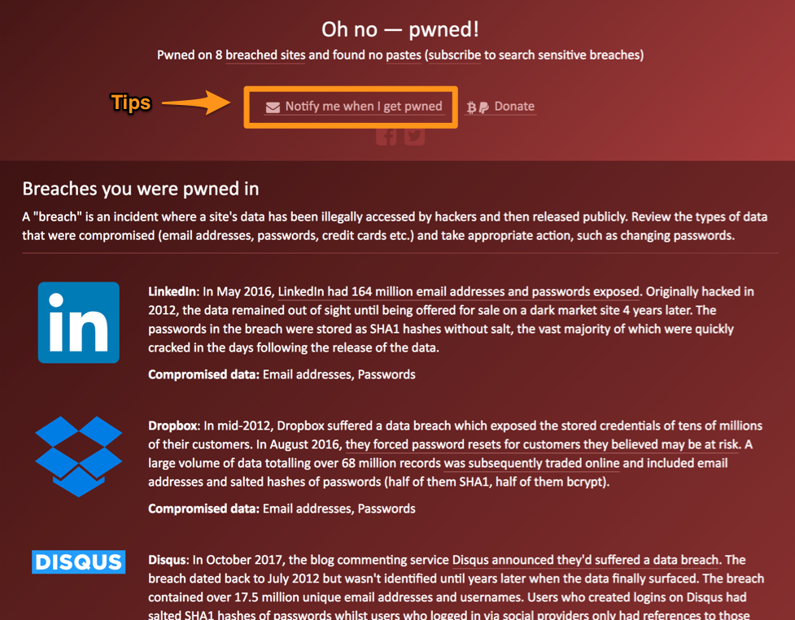

Passord er noe hærk!

Ønsker du kun løsning? Klikk deg videre til [1Password](https://1password.com/) og følg deres instruksjoner. Gjøre du det vil du automatisk få gode passordrutiner.

# Gode passord rutiner

1.  Gode passord.
2.  Ikke bruk samme passord flere steder.
3.  Er det ekstra viktig, skru på to-faktor autentisering.

Punktene over resulterer i at du burde bruke et passord-håndteringsprogram som [1Password](https://1password.com/) eller en notatbok alla [My password journal](http://amzn.to/2DZSDEX).

## 1. Gode passord

Lange relativt enkle passord "brimful-praise-buckaroo-dave", er bedre enn korte komplekse passord "L3t!tg0" ("Let it go" med erstatninger for e, i og o).

"Men vent nå litt. På jobben er det maks 12 tegn og det må være minst 1 tall og et spesialtegn" tenker du kansje. Dem om det! Ekspertene er uenig og tegneseriestripen fra xkcd forklarer hvorfor.

## 2. Unike passord

Ikke bruk samme passord flere steder.

Når en av tjeneste du bruker blir "eid", og innloggingsdetaljene dine ligger til salgs på the dark web, er det fint å vite at kjøperen ikke kan komme seg videre inn i andre tjenester du bruker.

Innloggingsdetaljer lekkes oftere enn man skulle tro. Sjekk om din bruker har vært del i en, eller flere, av de store internasjonale skandalene på [Have I've been pawned](https://haveibeenpwned.com/).

Det kan også være en gode idé å si ja takk til "Notify me when I get pawned". Tjenesten leveres av den anerkjente sikkerhetseksperten Troy Hunt.

## 3. To faktor autentisering.

To faktor autentisering (2FA) kommer i flere varianter. Det kan være komplekse løsninger som BankId; noe så enkelt som en sms med en kode eller et ark du har fått tilsendt i posten med koder.

Det skal et mye mer sofistikert, og rettet angrep, for at noen får tak i passordet ditt OG mobilen din (eller arket du har hjemme i skuffen) enn kun passordet.

To faktor autentisering kan være litt irriterende. Men er absolutt verdt å skru på for viktige tjenester.

Et sted du burde skru på to faktor autentisering, nå med en gang, er e-post kontoen din. Utestenging fra egen e-post konto vil medføre masse kjipt arbeid. I tillegg vil en person med tilgang til e-post kontoen din raskt få kontroll over dine kontoer hos andre tjenester.

* [Sku på 2FA hos Gmail](https://support.google.com/accounts/answer/185839)
* [Skru på 2FA hos Outlook.com/Hotmail](https://support.microsoft.com/en-in/help/12408/microsoft-account-about-two-step-verification)

## 4. Passord-håndteringsprogram

I realiteten betyr alt dette at du burde skaffe deg et passord-håndteringsprogram. Jeg anbefaler [1Password](https://1password.com/).

Mange spør meg "Men er 1Password sikkert da?". Ingenting på internett er 100% sikkert, men 1Passwords leverbrød er sikkerhet. Derfor er de sikrere enn de fleste tjenestene du har konto hos. I tillegg er det så uendelig mye bedre enn at du prøver å huske et stort antall unike og gode passord oppi hodet ditt.

Som sikkerhetsekspert Troy Hunt skriver på sin blogg: [Password managers don't have to be perfect, they just have to be better than not having one](https://www.troyhunt.com/password-managers-dont-have-to-be-perfect-they-just-have-to-be-better-than-not-having-one/).

Der slår han også et slag for den analoge versjonen, en notatblokk med nedskrevne passord. Ikke så dumt som du kanskje ville trodd.
